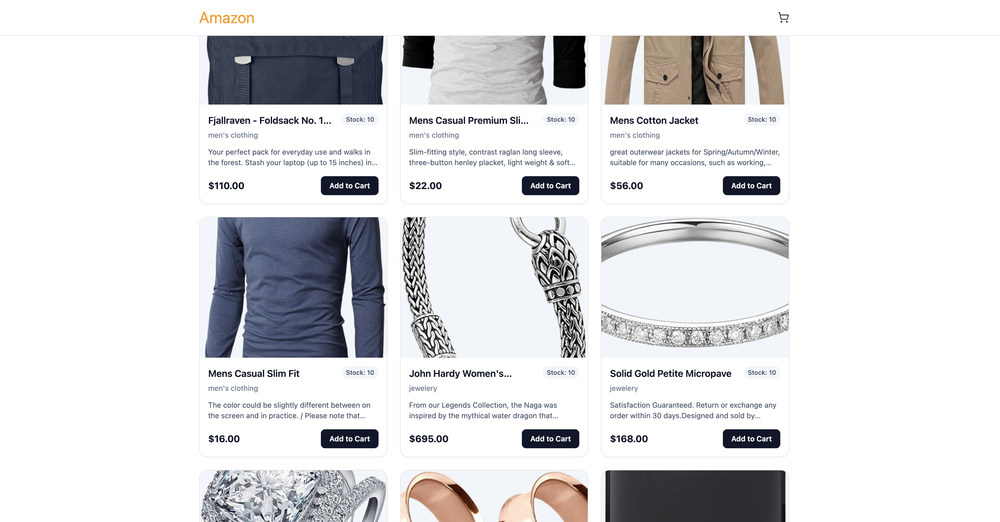
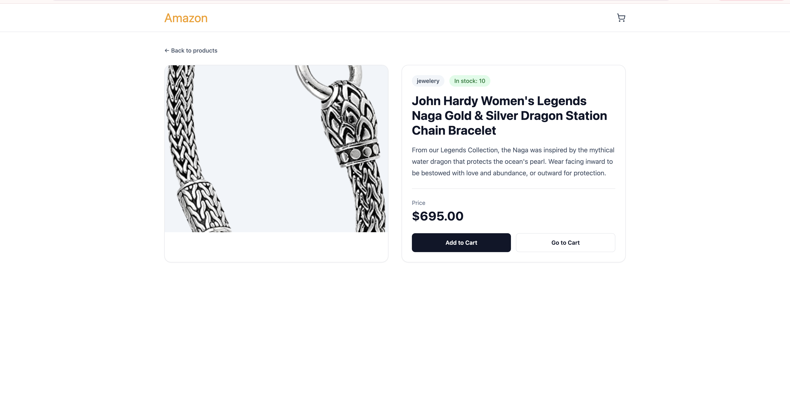
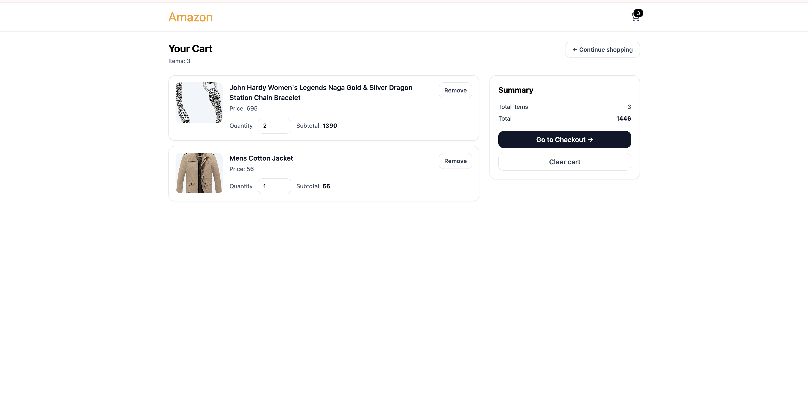

# Amazon E-Commerce Frontend

## Backend Repository
[Amazon E-Commerce Backend](https://github.com/samira-izadpoori/Amazon-E-Commerce-Backend)
## Screenshots

A responsive e-commerce frontend application built with React, TypeScript, Vite, and Tailwind CSS.

This project focuses on creating a modern shopping experience with clean UI, reusable components, and a user-friendly interface.

## Features

- Responsive e-commerce layout
- Product listing pages
- Product details
- Shopping cart functionality
- Clean and reusable component structure
- TypeScript-based code structure
- Modern UI built with Tailwind CSS

## Tech Stack

- React
- TypeScript
- Vite
- Tailwind CSS
- Vitest

